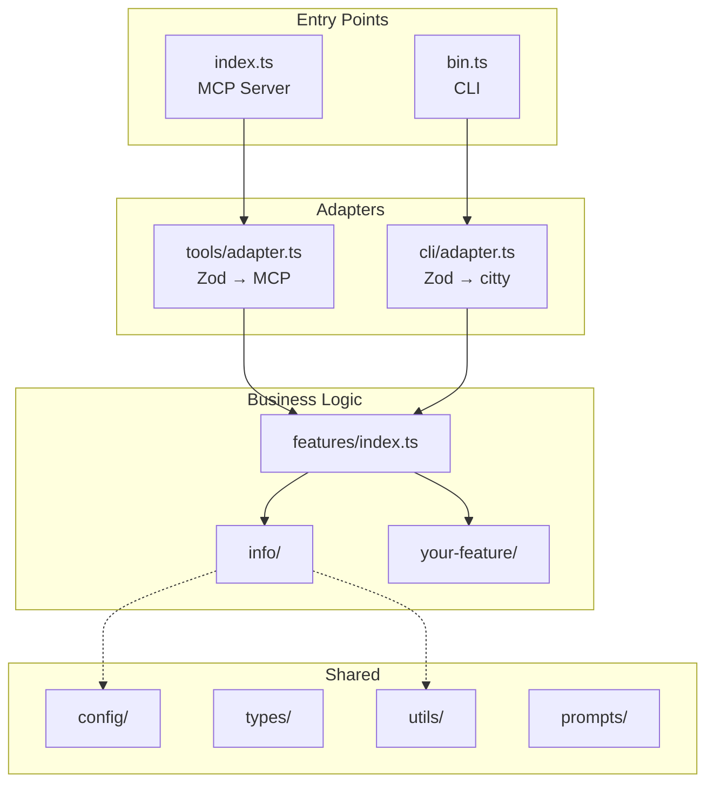
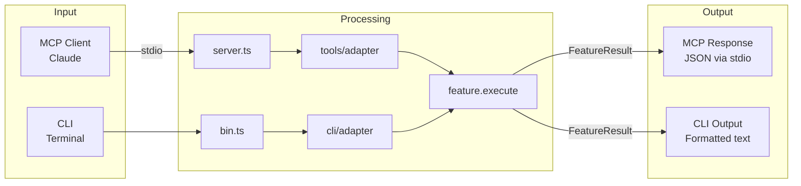

# MCP Server Development Guide

> Complete guide for building MCP servers with TypeScript and Bun.

**Related documentation:**
- 📖 [README](./README.md) — Project overview, quick start, and features
- 🤝 [Contributing Guide](./CONTRIBUTING.md) — How to contribute to this project
- 📋 [Changelog](./CHANGELOG.md) — Version history
- 📄 [LICENSE](./LICENSE) — MIT License
- 🤝 [Code of Conduct](./CODE_OF_CONDUCT.md) — Community guidelines

## Table of Contents

1. [Naming Conventions](#naming-conventions)
2. [Project Structure](#project-structure)
3. [Creating Features](#creating-features)
4. [Testing Strategy](#testing-strategy)
5. [MCP Protocol](#mcp-protocol)
6. [CLI Integration](#cli-integration)
7. [Configuration](#configuration)
8. [MCP Client Setup](#mcp-client-setup)
9. [Security](#security)
10. [Versioning](#versioning)
11. [Releasing](#releasing)
12. [SEO & Publishing](#seo--publishing)
13. [Best Practices](#best-practices)

---

## Naming Conventions

| Element | Convention | Example |
|---------|------------|---------|
| GitHub repo | `mcp-<name>` or `<name>-mcp` | `structured-repo-context-mcp` |
| npm package | `<name>-mcp` (preferred) | `src-mcp` |
| Tool names | snake_case + verb | `get_server_info`, `create_index` |
| Resource names | snake_case | `server_info`, `file_content` |
| Resource URIs | Valid URI scheme | `src://server/info` |
| Prompt names | snake_case or kebab-case | `analyze_code`, `code-review` |
| TypeScript code | camelCase | `getServerInfo()`, `infoFeature` |
| Folders | lowercase or kebab-case | `features/`, `my-feature/` |

### Tool Names (Critical for LLMs)

Use **snake_case** with imperative verbs:

**Common verb prefixes:**
- `get_` - Retrieve single item
- `list_` - Retrieve multiple items
- `create_` - Create new item
- `update_` - Modify existing item
- `delete_` - Remove item
- `search_` - Search/query
- `analyze_` - Process and return insights

> See `src/features/info/index.ts` for example: `name: "get_server_info"`

---

## Project Structure

```
src/
├── index.ts              # MCP server entry point
├── bin.ts                # CLI entry point
├── server.ts             # Server configuration
├── features/             # Shared business logic
│   ├── index.ts          # Feature exports
│   ├── types.ts          # Feature types
│   └── info/             # Server info feature
│       ├── index.ts
│       └── index.test.ts
├── tools/                # MCP tools adapter
├── resources/            # MCP resources
├── prompts/              # MCP prompts
├── cli/                  # CLI adapter
├── config/               # Configuration
├── types/                # Shared TypeScript types
└── utils/                # Utilities (logger, colors, spinner)
```

### Key Principles

1. **Features are the core** - Business logic lives in `features/`
2. **Adapters expose features** - `tools/` and `cli/` adapt features to interfaces
3. **Colocate unit tests** - `index.test.ts` next to `index.ts`
4. **Flat when possible** - Avoid deep nesting (max 3 levels)

### Architecture Diagram



### Data Flow



---

## Creating Features

Every feature follows this pattern:

1. Define input schema with Zod
2. Export input type
3. Implement execute function
4. Export feature definition

### Reference Implementation

See the `info` feature as reference:

| File | Description |
|------|-------------|
| [`src/features/info/index.ts`](src/features/info/index.ts) | Feature implementation |
| [`src/features/info/index.test.ts`](src/features/info/index.test.ts) | Unit tests |
| [`src/features/types.ts`](src/features/types.ts) | `Feature` and `FeatureResult` interfaces |

### Creating a New Feature

1. Create folder: `src/features/my_feature/`
2. Create `index.ts` following the pattern in `src/features/info/index.ts`
3. Create `index.test.ts` following the pattern in `src/features/info/index.test.ts`
4. Register in `src/features/index.ts`

### Registering Features

Add your feature to [`src/features/index.ts`](src/features/index.ts):
- Export the feature
- Add to the `features` array

The feature is then automatically available as MCP tool and CLI command.

### Key Concepts

| Concept | Description |
|---------|-------------|
| **Zod Schema** | Define input validation with `.describe()` for LLM understanding |
| **FeatureResult** | Return `{ success, message, data, error }` |
| **Async support** | `execute` can return `Promise<FeatureResult>` |
| **Error handling** | Return `{ success: false, error: "message" }` |

### Zod Best Practices

| Practice | Example |
|----------|---------|
| Add descriptions | `.describe("User query")` |
| Set limits | `.max(1000)` |
| Use enums | `.enum(["json", "text"])` |
| Provide defaults | `.optional().default("text")` |

---

## Testing Strategy

### Colocated Unit Tests

Tests are placed next to source files:

```
src/features/my_feature/
├── index.ts          # Implementation
└── index.test.ts     # Unit tests
```

See [`src/features/info/index.test.ts`](src/features/info/index.test.ts) for test examples.

### Running Tests

```bash
bun test              # Run all tests (or: npm test)
bun run test:watch    # Watch mode (or: npm run test:watch)
bun run test:coverage # With coverage (or: npm run test:coverage)
```

---

## MCP Protocol

### Tools Adapter

Features are automatically exposed as MCP tools via the adapter.

> See `src/tools/adapter.ts` for implementation and `src/tools/index.ts` for registration

### Resources

> See `src/resources/index.ts` for resource registration example

### Prompts

> See `src/prompts/index.ts` for prompt registration

### Server Setup

> See `src/server.ts` for server configuration and `src/index.ts` for server entry point with stdio transport

---

## CLI Integration

Features are automatically exposed as CLI commands via the adapter.

> See `src/cli/adapter.ts` for feature-to-CLI transformation, `src/cli/parser.ts` for Zod-to-CLI option conversion, and `src/bin.ts` for CLI entry point

### Usage

```bash
bun run cli help                             # or: npm run cli help
bun run cli <feature_name> --help            # or: npm run cli <feature_name> --help
bun run cli get_server_info --format json   # or: npm run cli get_server_info --format json
```

---

## Configuration

### Environment Variables

| Variable | Description | Default |
|----------|-------------|---------|
| `NODE_ENV` | Environment mode | `undefined` |
| `LOG_LEVEL` | Logging level | `info` |

> See `src/config/index.ts` for configuration setup

---

## MCP Client Setup

### Configuration

Add this configuration to your MCP client:

**Development (local path):**

```json
{
  "mcpServers": {
    "src-mcp": {
      "command": "node",
      "args": ["run", "/absolute/path/to/src-mcp/src/index.ts"]
    }
  }
}
```

**Production with bun (recommended):**

```json
{
  "mcpServers": {
    "src-mcp": {
      "command": "bunx",
      "args": ["src-mcp", "serve"]
    }
  }
}
```

**Production with npm:**

```json
{
  "mcpServers": {
    "src-mcp": {
      "command": "npx",
      "args": ["-y", "src-mcp", "serve"]
    }
  }
}
```

### Transport Options

- **stdio (Default)** - Recommended for local usage
- **Streamable HTTP** - For networked/scalable servers

> Note: SSE transport is deprecated as of MCP spec 2025-06-18.

---

## Security

### Checklist

- [ ] Validate all inputs with Zod schemas
- [ ] Prevent path traversal attacks
- [ ] Never expose secrets in responses
- [ ] Use HTTPS for HTTP transports
- [ ] Implement rate limiting for public servers
- [ ] Keep dependencies updated

### Input Validation

Always use Zod schemas with constraints:
- `z.string().max(1000)` - Limit string length
- `z.enum([...])` - Restrict to allowed values
- `.refine()` - Custom validation (e.g., path traversal check)

---

## Versioning

Follow [Semantic Versioning](https://semver.org/):

| Change Type | Version Bump | Example |
|-------------|--------------|---------|
| Breaking changes | MAJOR | 1.0.0 → 2.0.0 |
| New features | MINOR | 1.0.0 → 1.1.0 |
| Bug fixes | PATCH | 1.0.0 → 1.0.1 |

```bash
npm version patch   # Bug fixes
npm version minor   # New features
npm version major   # Breaking changes
```

---

## Releasing

### Release Process

Releases are triggered by merging to `main` with `[release]` in the commit message.

**Steps:**

1. Update version in `package.json`
2. Merge `dev` → `main` with `[release]` in commit message
3. GitHub Actions automatically:
   - Generates CHANGELOG.md from conventional commits
   - Commits the changelog to main
   - Creates a GitHub Release with release notes
   - Publishes to npm with provenance

**Example:**

```bash
# On dev branch
npm version minor                    # Bump version (1.0.0 → 1.1.0)
git push origin dev

# Create PR or merge to main
git checkout main
git merge dev -m "chore(release): v1.1.0 [release]"
git push origin main
# → GitHub Actions handles the rest
```

**Valid release commit messages:**

```
chore(release): v1.1.0 [release]
feat: add new feature [release]
fix: critical bug fix [release]
```

> **Note:** Without `[release]` in the commit message, no release is created.

### Changelog

The changelog is auto-generated from [conventional commits](https://www.conventionalcommits.org/):

| Commit Type | Changelog Section |
|-------------|-------------------|
| `feat:` | Features |
| `fix:` | Bug Fixes |
| `perf:` | Performance Improvements |
| `revert:` | Reverts |

Other types (`docs:`, `style:`, `refactor:`, `test:`, `chore:`) are not included in the changelog.

**Manual generation:**

```bash
bun run changelog    # or: npm run changelog
```

---

## SEO & Publishing

### GitHub Repository

**Required:**
- Clear description with keywords
- Topics (10-15 relevant tags)
- Homepage URL (npm page)
- License file
- README with badges

**Topics to include:**
`mcp`, `model-context-protocol`, `llm`, `ai-tools`, `developer-tools`, `typescript`

### package.json

**Required fields:**
- `name`, `version`, `description`
- `keywords` (for npm search)
- `repository`, `homepage`, `bugs`
- `author`, `license`

> See `package.json` for complete example

### Publishing

```bash
npm login
npm publish
```

---

## Best Practices

### Code Quality

- TypeScript strict mode (see `tsconfig.json`)
- ESLint strictTypeChecked (see `eslint.config.mjs`)
- Prettier formatting (see `prettier.config.mjs`)

### Descriptions for LLMs

Write clear descriptions that help LLMs understand when to use tools:
- Be specific: "Search for function definitions by name"
- Not vague: "Search code"

### Schema Descriptions

Every Zod field should have `.describe()` for LLM understanding.

### Idempotency

MCP tools may be called multiple times. Make operations idempotent when possible.

### Performance

- Use pagination for large results
- Implement caching where appropriate
- Return only necessary data

---

## Quick Reference

### Checklist for New Features

- [ ] Create folder: `src/features/feature_name/`
- [ ] Create `index.ts` with schema, execute, feature export
- [ ] Create `index.test.ts` with unit tests
- [ ] Add to `src/features/index.ts`
- [ ] Use snake_case for feature name
- [ ] Add `.describe()` to all schema fields
- [ ] Test via CLI: `bun run cli feature_name --help` (or: `npm run cli`)

### Checklist for Publishing

- [ ] All tests pass: `bun test` (or: `npm test`)
- [ ] Code checks pass: `bun run check` (or: `npm run check`)
- [ ] README is complete
- [ ] package.json has all metadata
- [ ] GitHub topics are set
- [ ] Version is updated

### Useful Commands

```bash
# Development
bun run dev                # Watch mode (or: npm run dev)
bun run test:watch         # Test watch mode (or: npm run test:watch)

# Quality checks
bun run check              # All checks (or: npm run check)

# CLI
bun run cli help           # or: npm run cli help
bun run cli <feature> --help  # or: npm run cli <feature> --help
```

---

## Resources

### Project Documentation
- [README](./README.md) — Project overview and quick start
- [Contributing Guide](./CONTRIBUTING.md) — Setup, testing, and PR process
- [Changelog](./CHANGELOG.md) — Version history
- [Code of Conduct](./CODE_OF_CONDUCT.md) — Community guidelines
- [LICENSE](./LICENSE) — MIT License

### External Resources
- [MCP Specification](https://modelcontextprotocol.io/specification)
- [MCP TypeScript SDK](https://github.com/modelcontextprotocol/typescript-sdk)
- [MCP Server Naming Conventions](https://zazencodes.com/blog/mcp-server-naming-conventions)
- [Official MCP Servers](https://github.com/modelcontextprotocol/servers)
